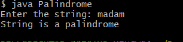
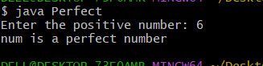

# ADDITIONAL-EXPERIMENT
# Additional1
# TITLE: Additional-1.) Java program to Insert a sub string into a given main string from a given position
```
import java.util.Scanner;

class SubString {

    public static void main(String args[]) {

        String mainString;
        String subString;
        int position;

        Scanner sc = new Scanner(System.in);

        System.out.print("Enter the main String: ");
        mainString = sc.nextLine();

        System.out.print("Enter the sub String: ");
        subString = sc.nextLine();

        System.out.print("Enter the position to insert: ");
        position = sc.nextInt();

        int length = mainString.length() - 1;
        String resultString;

        if (position >= 0 && position <= length) {

            String firstPart = mainString.substring(0, position);
            String secondPart = mainString.substring(position);

            resultString = firstPart + subString + secondPart;

            System.out.println("Resultant string = " + resultString);
        }
        else {

            System.out.println("Substring is not possible to insert");
            System.out.println("Its condition 0 <= position <= length of main string");
        }
    }
}
```
# output

#Additional2
## TITLE: 2.)Implement the sum of the n Fibonacci numbers
```
import java.util.Scanner;
class Fibonacci {
int sum;
int n;
int firstNumber;
int secondNumber;
int thirdNumber;
Fibonacci(int number) {
n = number;
firstNumber = 0;
secondNumber = 1;
thirdNumber = 0;
sum = 0;
}
void generate() {
if(n>0)
System.out.print("Fibonacci series: ");
while (n > 0) {
if (n == 1) {
System.out.println(firstNumber + ".");
sum = sum + firstNumber;
} else {
System.out.print(firstNumber + ", ");
sum = sum + firstNumber;
}
thirdNumber = firstNumber + secondNumber;
firstNumber = secondNumber;
secondNumber = thirdNumber;
n--;
}
System.out.println("Sum of Fibonacci series = " + sum);
}
public static void main(String[] args) {
Scanner sc = new Scanner(System.in);
System.out.print("Enter the value of n: ");
int number = sc.nextInt();
Fibonacci f = new Fibonacci(number);
f.generate();
}
}
```
# OUTPUT


# Additional3
# TITLE: Additional-3. ) Java program to determine if a given string is palindrome or not
```
import java.util.Scanner;

class Palindrome {

    public static void main(String[] args) {

        Scanner sc = new Scanner(System.in);

        System.out.print("Enter the string: ");
        String str = sc.nextLine();

        int start = 0;
        int end = str.length() - 1;
        boolean flag = true;

        while (start < end) {

            if (str.charAt(start) != str.charAt(end)) {
                flag = false;
                break;
            }

            start++;
            end--;
        }

        if (flag) {
            System.out.println("String is a palindrome");

        }
    }
}

# OUTPUT


# Additional-4
# TITLE: Additional-4 Java program to check if a number is a perfect number
```
import java.util.Scanner;

class Perfect {

    public static void main(String args[]) {

        Scanner sc = new Scanner(System.in);

        System.out.print("Enter the positive number: ");
        int num = sc.nextInt();

        int sum = 0;

        for (int i = 1; i < num; i++) {

            if (num % i == 0) {
                sum = sum + i;
            }
        }

        if (sum == num) {
            System.out.println("num is a perfect number");
        }
        else {
            System.out.println("num is not a perfect number");
        }
    }
    # OUTPUT

